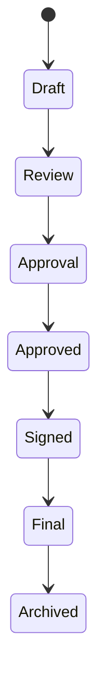

# Document Architecture

Supported document families include contracts, rent increases, acts/minutes, handovers, complaints, claims, receipts, invoices, tax records, house rules, insurance and formal communications.

Documents have immutable/versioned history, templates, attachments, approvals, signatures and generated PDFs.

Use structured content plus a human editor. AI output is always a draft.

Use Playwright/Chromium for deterministic HTML-to-PDF rendering and Tesseract for OCR where needed.

Separate internal approval, authorization, electronic signature and legally qualified signature. Never claim legal validity merely because a file has a signature.

Store metadata and authorization in PostgreSQL and binaries in private MinIO/S3-compatible storage.
