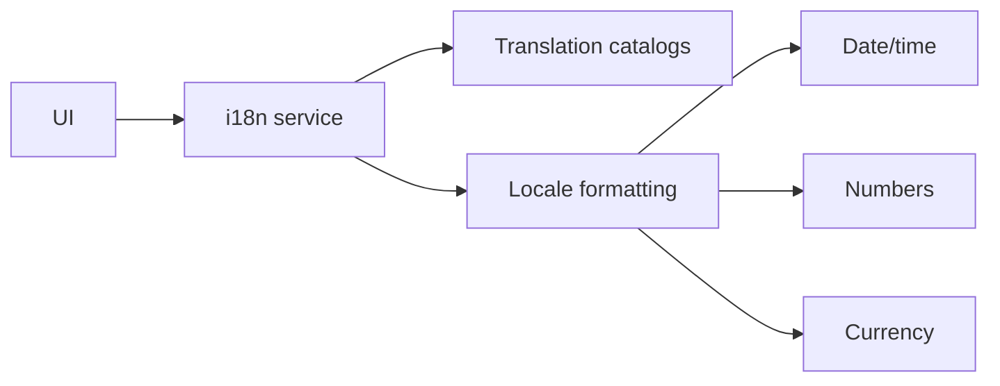

# Internationalization and Localization

i18n is a **Phase 1 requirement**, not a later enhancement.

## Initial locales

- `es-CO` — primary
- `en` — secondary

Language, country, currency and timezone are separate settings.

Example:
`language=es`, `country=CO`, `currency=COP`, `timezone=America/Bogota`.

## Architecture

All user-visible strings use semantic translation keys. No hard-coded UI strings in business logic.

Use locale-aware formatting for dates, numbers, percentages and currency. Do not manually concatenate currency symbols.

Backend-generated emails, notifications, validation messages and PDFs are localized too.

Store user language/timezone preferences and organization defaults. Resolve configuration using the documented inheritance rules.

Translation keys should be stable, e.g. `contracts.created`, `documents.status.approved`.

CI should detect missing translation keys. Representative E2E flows must run in both Spanish and English.

Document templates carry language and version metadata. Legal/contract translations are separate authoritative versions, not silently substituted text.

Adding another language must require catalog/template work rather than domain-code changes.
