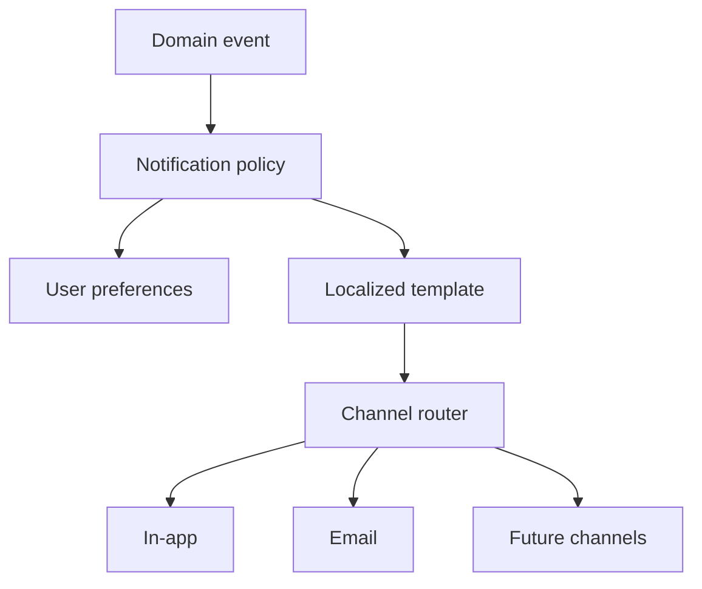

# Notifications and Communications

Phase 1 channels:

- in-app
- formal email

Future channels are adapters, not domain dependencies.

Formal communication records sender, recipients, subject, body, attachments, locale, timestamp, delivery state and related property/unit/workflow.

Email is asynchronous and retryable. Record the communication independently from provider delivery state.
