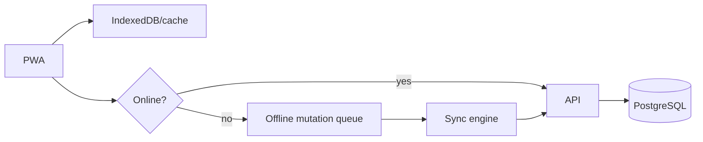

# Offline and Synchronization

Offline is a first-class capability for selected mobile workflows.

Offline-capable workflows are explicitly declared. Good candidates include inspection notes, photos, maintenance observations and drafts.

Final signatures, sensitive approvals and financial postings should normally require an online authorization check.

Queued mutations contain an operation ID, entity/version, operation, payload, client timestamp and retry state.

Use optimistic concurrency/version fields. Conflicts can be merged, server-wins, client-wins only for safe fields, or manually resolved. Financial/legal records prefer explicit resolution.

Minimize sensitive offline data, expire caches, clear protected data on logout where appropriate, and never treat offline state as authoritative until synchronized.
