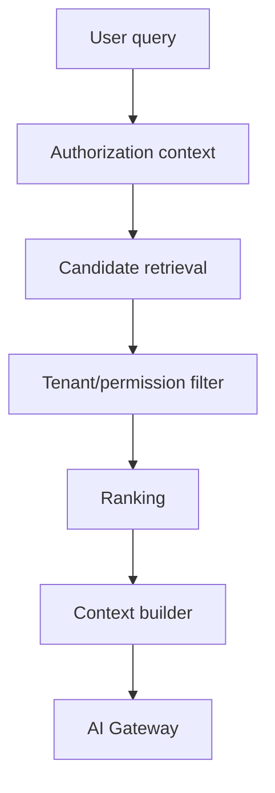

# Phase 3 — RAG + Knowledge Layer

## Objective

Permission-aware retrieval over authorized structured and unstructured organization knowledge.

## Technologies

- PostgreSQL + pgvector initially
- PostgreSQL full-text search initially
- Tesseract OCR
- existing document/PDF pipeline
- existing BullMQ workers
- AI Gateway
- embedding-provider abstraction
- source-aware chunking/indexing

Potential future OpenSearch/Tantivy only if measured search requirements justify it.

Sources include documents, contracts, acts, communications, complaints, repairs, invoices, receipts, property/unit records, rules, OCR text and permitted financial records.

Every chunk stores organization/resource scope, classification, language, source/version, content hash and embedding.

Evaluate retrieval precision/recall, source correctness, multilingual retrieval, stale indexes and—most importantly—permission leakage.
