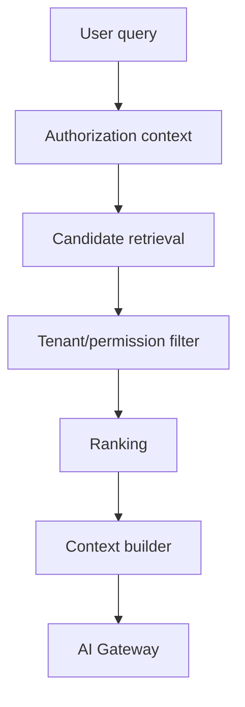

# Phase 3 — RAG + Knowledge Layer

## Objective

Permission-aware retrieval over authorized structured and unstructured organization knowledge.

## Technologies

- PostgreSQL + pgvector initially
- PostgreSQL full-text search initially
- Tesseract OCR
- existing document/PDF pipeline
- existing BullMQ workers
- AI Gateway
- embedding-provider abstraction
- source-aware chunking/indexing
- LangChain suite (leading orchestration candidate — see below)

Potential future OpenSearch/Tantivy only if measured search requirements justify it.

## LangChain evaluation (deferred to Phase 3 kickoff)

Consider the full LangChain suite for the RAG orchestration layer — chains/graphs, document
loaders, text splitters, pgvector integrations, evaluation harnesses — instead of hand-rolling
retrieval plumbing. Adoption bar, from the Charter and AI safety rules:

- everything stays behind the AI Gateway and provider abstraction; no LangChain import in domain
  business logic, same as model SDKs today.
- permission-aware retrieval is non-negotiable: tenant/permission filtering stays in our code
  (`FILTER` above) and is never delegated to the framework or the store.
- no mandatory SaaS: LangSmith tracing is opt-in only, off by default, and never ships tenant
  data without explicit configuration (same bar as any external provider).
- local-first must keep working: the RAG path runs fully local (self-hosted embeddings +
  pgvector + local model) with AI disabled as a graceful fallback.
- agentic pieces (LangGraph loops) stay out — agents are Phase 6–7, not Phase 3.

If the suite fails the bar, hand-rolled retrieval over pgvector remains the fallback.

Sources include documents, contracts, acts, communications, complaints, repairs, invoices, receipts, property/unit records, rules, OCR text and permitted financial records.

Every chunk stores organization/resource scope, classification, language, source/version, content hash and embedding.

Evaluate retrieval precision/recall, source correctness, multilingual retrieval, stale indexes and—most importantly—permission leakage.
