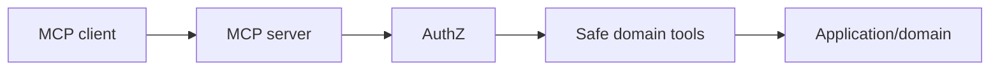

# Phase 5 — MCP

## Technologies

- TypeScript
- official MCP SDK
- existing auth/authz
- domain/application services
- audit/event system

Start read-only. Tools have explicit schemas, permissions, scopes, output classification and audit rules.

Never expose raw SQL or an unrestricted database tool.

Write tools come only after idempotency, validation and approval controls exist.
