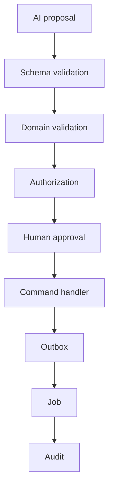

# Phase 6 — Controlled AI Actions

## Technologies

AI Gateway, RAG, BullMQ, transactional outbox, domain command handlers, idempotency keys, approval workflows, audit trail and feature flags.

AI proposes; deterministic domain code decides whether an action is valid. Consequential financial/legal/security changes require explicit policy and approval.
