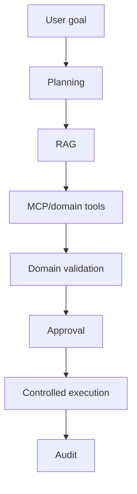

# Phase 7 — Advanced AI / Agentic Workflows

## Technologies

- AI Gateway/model router
- local and external model adapters
- RAG/pgvector
- MCP tools
- BullMQ workflows
- domain command handlers
- approval engine
- audit/event infrastructure
- OpenTelemetry
- evaluation harness
- feature flags

Do not add a dedicated agent/workflow framework until the existing architecture demonstrably cannot handle the required orchestration.

Require bounded tools, scoped permissions, tenant isolation, action schemas, idempotency, budgets, step limits, timeouts, kill switches and full auditability.

New models are evaluated against a stable benchmark before activation.
